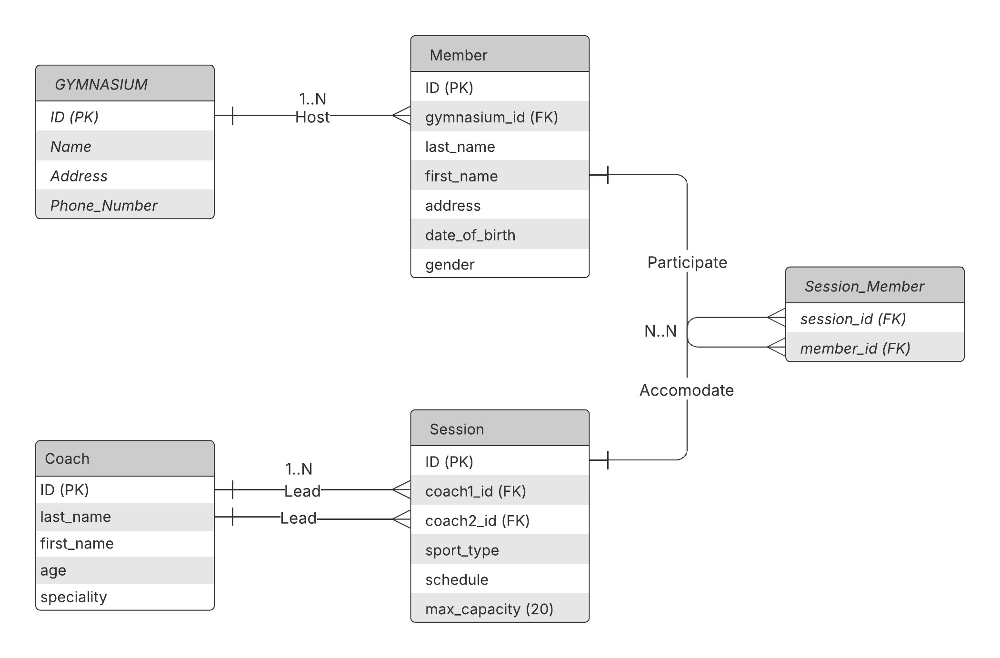

# Relational Databases : Entity–relationship model

## Problem

You decide to join a very large known gym chain. When you arrive, you go to the reception. You find the owner arguing with a member who wants to attend a session he has not registered for. Your turn finally arrives, the owner apologizes for letting you wait so long. He explains that his employee, in charge of registrations, made a mistake in choosing the member's session.

You are surprised that such a recognized gymnasium still uses the cards to manage its large number of clients. So you're talking to the owner to fix this problem. Interested in your knowledge, he asks you to find him a solution, in return he will offer you a free 3-months inscription.

**The owner informs you that :**

- he has several gymnasiums which are distinguished by their names, addresses and telephone number.
- Members can register at one of these gymnasiums, so they must provide the following information: unique identifier last name, first name, address, date of birth and gender.
- Each session is characterized by a type of sport and a schedule and can accommodate a maximum of 20 members.
- The sessions are led by a maximum of two coaches who have a last name, first name, age and specialty.

**Instructions**

Given the above mentioned text, try to create the according Entity relationship model.

## Entity Relationship Model

### Entities and Attributes

#### Gymnasium :

- ID (PK)

- Name

- Address

- Phone_Number

#### Member :

- ID (PK)

- last_name

- first_name

- address

- date_of_birth

- gender

#### Coach :

- ID (PK)

- last_name

- first_name

- age

- specialty

#### Session :

- ID (PK)

- sport_type

- schedule

- max_capacity (Default: 20)

### Relationships

#### 1. Gymnasium - Member (One-to-Many)

- A Gymnasium can have multiple Members, but each Member belongs to only one Gymnasium. (One-to-Many)
- We add new attribute gymnasium_id (FK referencing Gymnasium) to the entity members

#### 2. Coach - Session (One to Many)

- A coach can lead multiple Sessions, and each Session can have up to 2 coaches. (One to Many)
- We add 2 more attributes ( coach1_id, coach2_id ) (FK referencing Coach) to entity Session

#### 3. Session - Member (Many to Many)

- A Member can participate to many sessions & a Session can accomodate up to 20 members. (Many-to-Many)
- We create a new entity **Session_Member** and add 2 attributes (session_id (FK referencing Session), member_id (FK referencing Member))

## ERD Diagram

