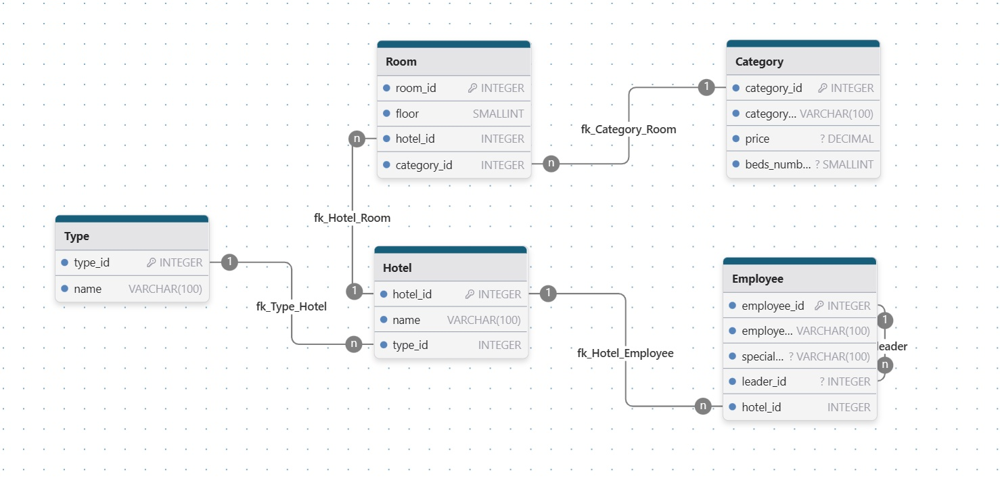

## Problem

After the construction of his hotels in one of the tourist areas, a director wishes to prepare a database to facilitate the management of his data.

The director has presented the following information to you through the entity relationship model.

[entity relationship model](https://i.imgur.com/oHkrfiJ.png)

**Instructions :**

Convert the entity relationship model to a relational diagram

## Relational Model

- Hotel (**<ins>hotel_id</ins>**, name, **#type_id**)

- Room (**<ins>room_id</ins>**, floor, **#hotel_id**, **#category_id**)

- Employee (**<ins>employee_id</ins>**, employee_name, speciality, **#leader_id**, **#hotel_id**)

- Type (**<ins>type_id</ins>**, name)

- Category (**<ins>category_id</ins>**, category_name, price, beds_numbers)

## Relationships

#### Hotel :

- Hotel Has Many Rooms (One to Many)
- Hotels Belongs To one Type (One to Many)

#### Room :

- Rooms Belongs To one Hotel (One to Many)
- Rooms Belongs To one Category (One to Many)

#### Category :

- Category can apply to multiple Rooms (One to Many)

#### Employee :

- Employees can work at one Hotel
- Self-referencing "leader" relationship: each Employee may have one Leader who is also an Employee (One To Many)

#### Type :

- Type is associated to different Hotels (One To Many)

## Diagram

